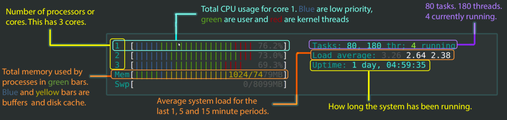
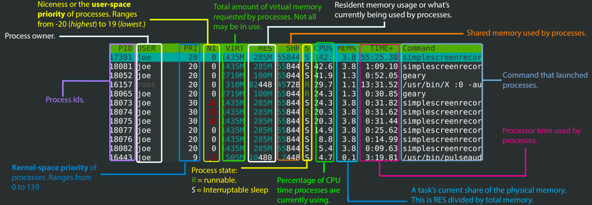

# CPU Benchmark

---

## Sysbench

[Sysbench](https://github.com/akopytov/sysbench) -- Scriptable database and system performance benchmark, a cross-platform and multi-threaded benchmark tool

```sh
sysbench --test=cpu --cpu-max-prime=20000 --num-threads=4 run
```

## htop

* [htop](http://hisham.hm/htop/) - an interactive process viewer for Unix

* [htop explained](https://peteris.rocks/blog/htop/) - Explanation of everything you can see in htop/top on Linux

<div align="center">
  
  
</div>

## 压力测试

https://www.tecmint.com/linux-cpu-load-stress-test-with-stress-ng-tool/

```sh
cat /sys/class/thermal/thermal_zone0/temp

# stress
stress --cpu 4 --io 4 --vm 1 --vm-bytes 1G
```
