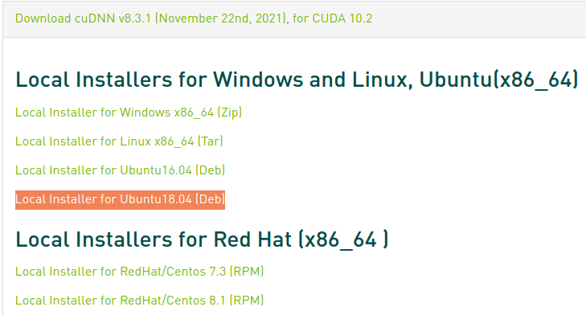

# CUDA

---

## Overview

CUDA® is a parallel computing platform and programming model developed by NVIDIA for general computing on graphical processing units (GPUs).

* [CUDA Zone](https://developer.nvidia.com/cuda-zone)
* [ArchaeaSoftware/cudahandbook](https://github.com/ArchaeaSoftware/cudahandbook)
* [CUDA for ARM Platforms is Now Available](https://devblogs.nvidia.com/cuda-arm-platforms-now-available/)

### Thrust

* [Thrust](http://thrust.github.io/)
* [Thrust in CUDA Toolkit](https://docs.nvidia.com/cuda/thrust/)


## Install

* https://developer.nvidia.com/cuda-toolkit


* cuda 9.0:
  https://developer.nvidia.com/cuda-90-download-archive?target_os=Linux&target_arch=x86_64&target_distro=Ubuntu&target_version=1604&target_type=runfilelocal


install

```sh
sudo sh cuda_8.0.44_linux.run --override --no-opengl-lib

sudo sh cuda_9.0.176_384.81_linux.run

sudo sh cuda_10.0.130_410.48_linux.run --toolkit --silent # ubuntu 18.04
# for pytorch 1.10
sudo sh cuda_10.2.89_440.33.01_linux.run --toolkit --silent # ubuntu 18.04

sudo sh cuda_11.5.1_495.29.05_linux.run --toolkit --silent --override
```


config

```sh title=".bashrc"
export CUDA_HOME=$CUDA_HOME:/usr/local/cuda-10.0
export PATH=$PATH:$CUDA_HOME/bin

# or, add /usr/local/cuda-8.0/lib64 to /etc/ld.so.conf and run ldconfig as root
export LD_LIBRARY_PATH=$LD_LIBRARY_PATH:$CUDA_HOME/lib64
```

check

```sh
nvcc --version
# or
nvcc -V

# on Jetson  
cat /usr/local/cuda/version.txt
```

test

```sh
cd /usr/local/cuda-10.0/samples/1_Utilities/deviceQuery

sudo make

./deviceQuery
```

```title="output"
./deviceQuery Starting...

 CUDA Device Query (Runtime API) version (CUDART static linking)

Detected 1 CUDA Capable device(s)

Device 0: "NVIDIA GeForce GTX 1660 SUPER"
  CUDA Driver Version / Runtime Version          11.4 / 8.0
  CUDA Capability Major/Minor version number:    7.5
  Total amount of global memory:                 5943 MBytes (6232014848 bytes)
MapSMtoCores for SM 7.5 is undefined.  Default to use 128 Cores/SM
MapSMtoCores for SM 7.5 is undefined.  Default to use 128 Cores/SM
  (22) Multiprocessors, (128) CUDA Cores/MP:     2816 CUDA Cores
  GPU Max Clock rate:                            1785 MHz (1.78 GHz)
  Memory Clock rate:                             7001 Mhz
  Memory Bus Width:                              192-bit
  L2 Cache Size:                                 1572864 bytes
  Maximum Texture Dimension Size (x,y,z)         1D=(131072), 2D=(131072, 65536), 3D=(16384, 16384, 16384)
  Maximum Layered 1D Texture Size, (num) layers  1D=(32768), 2048 layers
  Maximum Layered 2D Texture Size, (num) layers  2D=(32768, 32768), 2048 layers
  Total amount of constant memory:               65536 bytes
  Total amount of shared memory per block:       49152 bytes
  Total number of registers available per block: 65536
  Warp size:                                     32
  Maximum number of threads per multiprocessor:  1024
  Maximum number of threads per block:           1024
  Max dimension size of a thread block (x,y,z): (1024, 1024, 64)
  Max dimension size of a grid size    (x,y,z): (2147483647, 65535, 65535)
  Maximum memory pitch:                          2147483647 bytes
  Texture alignment:                             512 bytes
  Concurrent copy and kernel execution:          Yes with 3 copy engine(s)
  Run time limit on kernels:                     Yes
  Integrated GPU sharing Host Memory:            No
  Support host page-locked memory mapping:       Yes
  Alignment requirement for Surfaces:            Yes
  Device has ECC support:                        Disabled
  Device supports Unified Addressing (UVA):      Yes
  Device PCI Domain ID / Bus ID / location ID:   0 / 1 / 0
  Compute Mode:
     < Default (multiple host threads can use ::cudaSetDevice() with device simultaneously) >

deviceQuery, CUDA Driver = CUDART, CUDA Driver Version = 11.4, CUDA Runtime Version = 8.0, NumDevs = 1, Device0 = NVIDIA GeForce GTX 1660 SUPER
Result = PASS
```

### Install cuDNN

- [https://developer.nvidia.com/cudnn](https://developer.nvidia.com/cudnn)

<p align="center">
  
</p>

解压，并进入到相应目录，运行以下命令

```bash
sudo cp <cudnn-path>/include/* /usr/local/cuda-10.2/include/
sudo cp <cudnn-path>/lib/* /usr/local/cuda-10.2/lib64/
```

查看cuDNN版本

```bash
cat /usr/local/cuda-10.2/include/cudnn.h | grep CUDNN_MAJOR -A 2

# Jetson
cat /usr/local/cuda/include/cudnn.h | grep CUDNN_MAJOR -A 2
cat /usr/include/cudnn.h | grep CUDNN_MAJOR -A 2
```