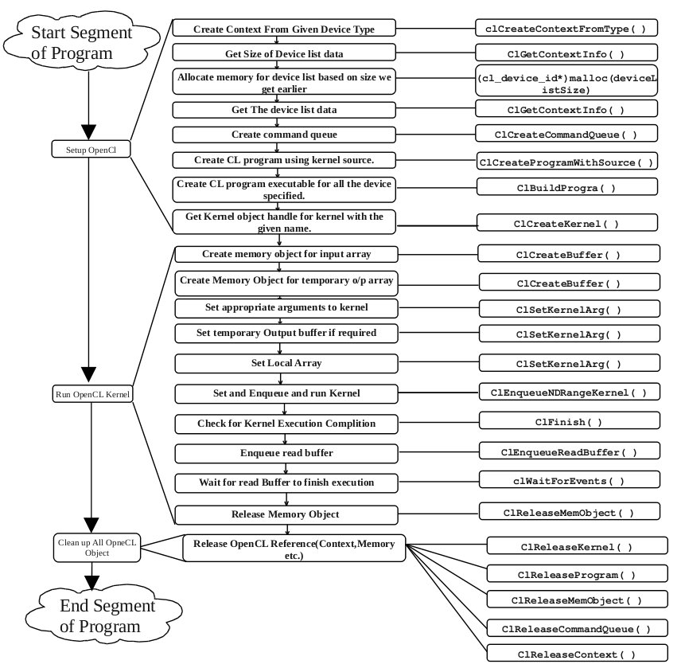

# OpenCL

---

## Overview

[OpenCL™](https://www.khronos.org/opencl/) (Open Computing Language) is the open, royalty-free standard for cross-platform, parallel programming of diverse processors found in personal computers, servers, mobile devices and embedded platforms.

<p align="center">
  
</p>

* install OpenCL
  ```sh
  # required: Ubuntu 16.04, nvidia GPU and nvidia driver installed
  sudo apt-get install nvidia-prime nvidia-modprobe nvidia-opencl-dev
  sudo ln -s /usr/lib/x86_64-linux-gnu/libOpenCL.so.1 /usr/local/lib/libOpenCL.so
  ```

* build program
  ```sh
  g++ main.cpp -lOpenCL
  ```
