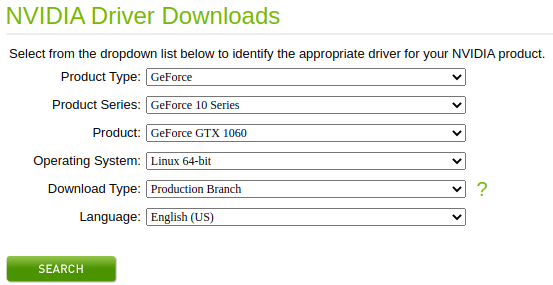

# Nvidia

---

## Overview

- [https://blog.csdn.net/huanghaihui_123/article/details/87985403](https://blog.csdn.net/huanghaihui_123/article/details/87985403)

- [https://www.linkedin.com/pulse/installing-nvidia-cuda-80-ubuntu-1604-linux-gpu-new-victor/](https://www.linkedin.com/pulse/installing-nvidia-cuda-80-ubuntu-1604-linux-gpu-new-victor/)

## Check Graphics Card

* Check your Nvidia graphics card
  ```sh
  lspci | grep -E "VGA|3D"
  ```
  or
  ```sh
  lspci | grep -i vga
  lspci  -v -s 01:00.0
  ```

* check which driver is being used for Nvidia card
  ```sh
  sudo lshw [-numeric] -C display 
  ```
  or
  ```sh
  sudo lshw -c video
  ```

* query and select driver
  ```sh
  prime-select query
  sudo prime-select nvidia
  ```

```title="output"
WARNING: you should run this program as super-user.
  *-display                 
       description: VGA compatible controller
       product: GP106 [GeForce GTX 1060 3GB] [10DE:1C02]
       vendor: NVIDIA Corporation [10DE]
       physical id: 0
       bus info: pci@0000:01:00.0
       version: a1
       width: 64 bits
       clock: 33MHz
       capabilities: vga_controller bus_master cap_list rom
       configuration: driver=nvidia latency=0
       resources: irq:130 memory:f6000000-f6ffffff memory:e0000000-efffffff memory:f0000000-f1ffffff ioport:e000(size=128) memory:f7000000-f707ffff
  *-display
       description: VGA compatible controller
       product: HD Graphics 630 [8086:5912]
       vendor: Intel Corporation [8086]
       physical id: 2
       bus info: pci@0000:00:02.0
       version: 04
       width: 64 bits
       clock: 33MHz
       capabilities: vga_controller bus_master cap_list rom
       configuration: driver=i915 latency=0
       resources: irq:128 memory:f5000000-f5ffffff memory:d0000000-dfffffff ioport:f000(size=64) memory:c0000-dffff
WARNING: output may be incomplete or inaccurate, you should run this program as super-user.
```

### Nvidia Jetson

* 查看系统信息
  ```sh
  cat /etc/lsb-release # 查看系统版本
  uname -a # 查看系统内核
  ```

* 查询Jetson设备与开发环境版本的基础信息
    - http://www.gpus.cn/gpus_list_page_techno_support_content?id=39  

* 查看系统的l4t的版本号
  ```sh
  head -n 1 /etc/nv_tegra_release
  ```


## Install Nvidia Drivers

###  Drivers in App Store

查看驱动

```sh
ubuntu-drivers devices
```

```title="output"
WARNING:root:_pkg_get_support nvidia-driver-390: package has invalid Support Legacyheader, cannot determine support level
== /sys/devices/pci0000:00/0000:00:01.0/0000:01:00.0 ==
modalias : pci:v000010DEd00001C02sv00001043sd000085BCbc03sc00i00
vendor   : NVIDIA Corporation
model    : GP106 [GeForce GTX 1060 3GB]
driver   : nvidia-driver-450-server - distro non-free
driver   : nvidia-driver-418-server - distro non-free
driver   : nvidia-driver-495 - distro non-free
driver   : nvidia-driver-460-server - distro non-free
driver   : nvidia-driver-470 - distro non-free recommended
driver   : nvidia-driver-390 - distro non-free
driver   : nvidia-driver-460 - distro non-free
driver   : nvidia-driver-470-server - distro non-free
driver   : xserver-xorg-video-nouveau - distro free builtin
```

安装驱动

```sh
sudo ubuntu-drivers autoinstall
# or
sudo apt install nvidia-470
```

### Install Drivers Manually

* [2 Ways to Install Nvidia Driver on Ubuntu 18.04 (GUI & Command Line)](https://www.linuxbabe.com/ubuntu/install-nvidia-driver-ubuntu-18-04)

* [https://xungejiang.com/2019/10/08/ubuntu-gpu-driver/](https://xungejiang.com/2019/10/08/ubuntu-gpu-driver/)

* [https://zhuanlan.zhihu.com/p/59618999](https://zhuanlan.zhihu.com/p/59618999)


**download nvidia drivers**:

* https://www.geforce.com/drivers

* [https://www.nvidia.com/Download/index.aspx](https://www.nvidia.com/Download/index.aspx)

<p align="center">
  
</p>

**disable and check nouveau**:

* disable nouveau  
  ```sh
  sudo vim /etc/modprobe.d/blacklist.conf
  ```
  and add below in it
  ```sh
  blacklist nouveau
  options nouveau modeset=0
  ```
* update and reboot
  ```sh
  sudo update-initramfs -u
  sudo reboot
  ```
* check nouveau
  ```sh
  lsmod | grep nouveau
  ```

**Ubuntu 18.04 begin**

- Ubuntu 18.04：登录时按 `ctrl + alt + F2` 进入命令行并使用用户名密码登录，并输入 `sudo telinit 3` 打开一个新的 TTY1 界面，安装
    
    ```bash
    sudo apt-get remove nvidia-*
    
    sudo bash ./NVIDIA-Linux-x86_64-396.18.run
    ```
    
    Ubuntu 18.04至此安装结束！

**Ubuntu 18.04 end**

**enter tty and turn off gui**:

* enter tty1
  ```sh
  ctrl+alt+f1
  ```
* turn off gui
  ```sh
  sudo service lightdm stop
  ```

**install nvidia drivers**:

```sh
sudo apt-get remove nvidia-*
sudo ./NVIDIA-Linux-x86_64-396.18.run -no-x-check -no-nouveau-check -no-opengl-files
```

- no-x-check：安装驱动时关闭X服务
- no-nouveau-check：安装驱动时禁用nouveau
- no-opengl-files：只安装驱动文件，不安装OpenGL文件, 只有禁用opengl这样安装才不会出现循环登陆的问题

**check status and settings**:

* check your installation status
  ```sh
  lsmod | grep nvidia
  ```
  or
  ```sh
  nvidia-smi
  ```

* settings
  ```sh
  nvidia-settings
  ```

**uninstall nvidia drivers**:

* uninstall nvidia drivers
  ```sh
  sudo apt-get purge nvidia-*
  ```
  or
  ```sh
  sudo /usr/bin/nvidia-uninstall
  ```

## Install NVIDIA-Docker

* [用nvidia-docker跑深度学习模型](https://blog.csdn.net/weixin_42749767/article/details/82934294)
